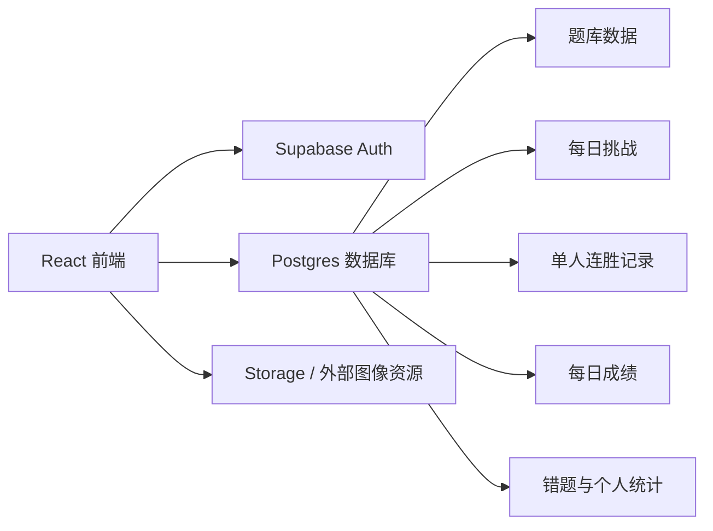

# 医影挑战赛第一阶段技术方案与数据库设计

## 1. 目标

这份文档把第一阶段 PRD 转成可落地的技术实现方案，重点解决四个问题：

1. 题库如何存储和管理
2. 用户成绩如何持久化
3. 每日挑战如何按天生成并防重复提交
4. 排行榜和错题本如何高效读取

## 2. 推荐技术选型

第一阶段推荐：

- 前端：React + Vite + TypeScript
- 后端：Supabase
- 数据库：PostgreSQL
- 图片：对象存储或外链托管
- 埋点：先用轻量事件表或第三方分析工具

当前实现补充：

- 前端已经采用 `本地 localStorage 持久化 + Supabase 可选接入` 的双轨方案
- 无 Supabase 环境时，项目仍可完整运行 MVP 玩法
- 已有本地训练历史与本地埋点事件流，后续可平滑替换为服务端事件表

推荐 Supabase 的原因：

- 这个项目当前是纯前端原型，接 Supabase 成本最低。
- 它同时覆盖 Auth、Postgres、Storage、Row Level Security。
- 第一阶段最关键的是快速把题库、成绩、排行榜、每日挑战跑起来，而不是自建复杂服务。

## 3. 整体架构



## 4. 第一阶段功能与技术映射

当前代码对应关系：

- 数据兜底层： [services/data.ts](/Users/kanyemic/Desktop/medical challenge/compete1/services/data.ts)
- Supabase 接入层： [services/backend.ts](/Users/kanyemic/Desktop/medical challenge/compete1/services/backend.ts)
- 本地用户与统计： [services/playerIdentity.ts](/Users/kanyemic/Desktop/medical challenge/compete1/services/playerIdentity.ts)、[services/playerStats.ts](/Users/kanyemic/Desktop/medical challenge/compete1/services/playerStats.ts)、[services/playerHistory.ts](/Users/kanyemic/Desktop/medical challenge/compete1/services/playerHistory.ts)
- 本地埋点： [services/analytics.ts](/Users/kanyemic/Desktop/medical challenge/compete1/services/analytics.ts)

### 4.1 登录 / 游客模式

建议采用双身份模型：

- 游客：首次进入时由前端生成本地 `app_user_id`
- 正式用户：登录后绑定 `auth_user_id`

这样做的好处：

- 不会因为第一阶段没有完整注册流程而阻塞上线
- 用户可以先玩再注册
- 后续能把游客成绩迁移到正式账号

## 4.2 单人连胜

技术实现：

- 开局时创建 `solo_runs`
- 每答一题记录 `solo_run_answers`
- 结束时更新 run 的统计字段

这样可以同时支持：

- 历史最佳连胜
- 累计答题数
- 正确率
- 错题回溯

## 4.3 每日挑战

技术实现：

- 每天生成一条 `daily_challenges`
- 题目顺序写入 `daily_challenge_questions`
- 用户作答时创建 `daily_challenge_attempts`
- 每题答案写入 `daily_challenge_answers`

关键约束：

- 同一用户同一天只能有一条正式完成记录
- 当天所有用户用同一套题

## 4.4 排行榜

第一阶段只做两类：

- 最高连胜榜
- 每日挑战榜

技术上建议先用 SQL View 或查询聚合，不急着做复杂缓存。

## 4.5 错题本

错题本无需单独手工维护题目副本，直接基于作答记录聚合即可。

推荐做法：

- 从 `solo_run_answers` 和 `daily_challenge_answers` 里筛出错误记录
- 关联 `question_cases`
- 输出统一错题列表

这样可以避免数据冗余。

## 5. 核心数据模型

推荐的核心对象如下：

### 5.1 `app_users`

用途：

- 平台统一用户表
- 支持游客身份和正式账号绑定

关键字段：

- `id`
- `auth_user_id`
- `display_name`
- `avatar_url`
- `is_guest`
- `created_at`

### 5.2 `question_cases`

用途：

- 存储基础病例题库

关键字段：

- `specialty`
- `modality`
- `difficulty`
- `description`
- `options`
- `correct_answer`
- `explanation`
- `image_url`
- `source_name`
- `source_url`
- `review_status`

### 5.3 `daily_challenges`

用途：

- 描述某一天的正式挑战

关键字段：

- `challenge_date`
- `title`
- `status`

### 5.4 `daily_challenge_questions`

用途：

- 记录每日挑战题目顺序

关键字段：

- `challenge_id`
- `question_id`
- `order_index`
- `points`

### 5.5 `daily_challenge_attempts`

用途：

- 记录用户当天的正式挑战结果

关键字段：

- `user_id`
- `challenge_id`
- `score`
- `correct_count`
- `total_questions`
- `total_time_ms`
- `status`

### 5.6 `daily_challenge_answers`

用途：

- 记录每日挑战逐题作答明细

关键字段：

- `attempt_id`
- `question_id`
- `order_index`
- `selected_answer`
- `is_correct`
- `time_taken_ms`

### 5.7 `solo_runs`

用途：

- 记录单人连胜一整局

关键字段：

- `user_id`
- `streak_count`
- `correct_count`
- `total_answered`
- `total_time_ms`
- `ended_reason`

### 5.8 `solo_run_answers`

用途：

- 记录单人连胜逐题明细

关键字段：

- `run_id`
- `question_id`
- `sequence_no`
- `selected_answer`
- `is_correct`
- `time_taken_ms`

## 6. 关键查询设计

### 6.1 最高连胜榜

逻辑：

- 按用户聚合 `solo_runs`
- 取 `max(streak_count)`
- 按最高连胜倒序排序

### 6.2 每日挑战榜

逻辑：

- 按某个 `challenge_id`
- 按 `score desc, total_time_ms asc`
- 同分时耗时更短排名更高

### 6.3 个人统计

逻辑：

- 从 `solo_runs` 聚合历史最佳和累计答题数
- 从 `daily_challenge_attempts` 聚合近 7 天参与情况

### 6.4 错题本

逻辑：

- 从两类 answer 表中取 `is_correct = false`
- 联表题目表输出列表

## 7. 目录建议

如果你准备进入真实开发，建议把仓库逐步整理成这样：

```text
src/
  components/
  pages/
  features/
    solo/
    daily-challenge/
    leaderboard/
    profile/
    wrong-questions/
  lib/
    supabase/
  services/
    api/
supabase/
  schema.sql
  seed.sql
```

## 8. 前端接入建议

### 第一阶段前端应该拆出的服务层

- `authService`
- `questionService`
- `soloService`
- `dailyChallengeService`
- `leaderboardService`
- `profileService`

### 当前仓库建议优先重构的位置

- [App.tsx](/Users/kanyemic/Desktop/medical challenge/compete1/App.tsx) 应拆为页面和 feature 模块
- [services/data.ts](/Users/kanyemic/Desktop/medical challenge/compete1/services/data.ts) 应从 mock 数据源迁移为 API 服务层
- [types.ts](/Users/kanyemic/Desktop/medical challenge/compete1/types.ts) 可继续作为前端通用类型入口，但后续要补后端实体类型

## 9. 安全与合规建议

- 题目必须带来源信息
- AI 生成题目不能直接上线，至少需要审核状态字段
- 用户只能读写自己的作答记录
- 排行榜默认只暴露展示字段，不暴露敏感信息
- 所有页面明确标注“仅用于教育训练”

## 10. 上线顺序建议

建议按下面顺序实现：

1. 建库
2. 导入基础题库
3. 接入游客身份
4. 接单人连胜成绩持久化
5. 接每日挑战
6. 接排行榜
7. 接错题本和个人页

## 11. 结论

第一阶段最重要的不是做复杂后端，而是把数据模型一次设计对。

如果这套表结构先定下来，后续无论你继续用 Supabase，还是迁移到 NestJS / Java / Go，自身玩法和业务模型都不会乱。
